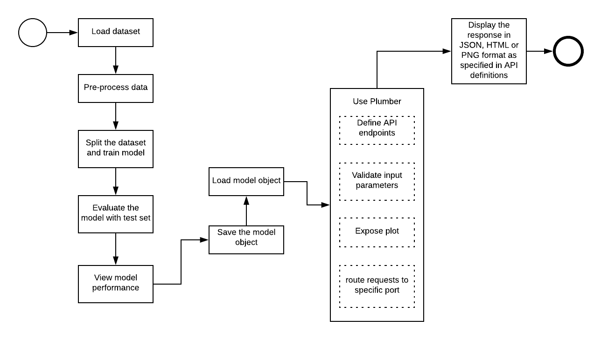

# Using Rest APIs to Expose Model as a Service
By exposing the R Model as Rest API, we can let other applications to use model for the purposes it is designed for without having to worry about the underlying environment/architecture.
We can do this using an R package - **"Plumber"**. Plumber is straightforward and easy to use. It is an open source package that lets you create APIs by decorating the R functions with special annotations/comments. Comments can be prefixed with "#'" or "#*". "#'" is recommended.

# Process flow diagram

# R Packages and Client Softwares
 - randomForest: R package used for taining the titanic problem using random forest algorithm. Check the **[random forest R Documentation](https://www.rdocumentation.org/packages/randomForest/versions/4.6-14/topics/randomForest)** for more details
 - caret: R package used for plotting Confusion Matrix to evaluate model performance. Check the **[caret R Documentation](https://www.rdocumentation.org/packages/caret)** for more details
 - plumber: R package to create REST APIs. Check the **[rplumber Documentation](https://www.rplumber.io/)** for more details
 - Postman: API Development Tool used for REST API validation. Check the **[Postman](https://www.getpostman.com/)** website for more details
 - curl: Command line tool used for REST API validation. Check the **[curl](https://curl.haxx.se/)** website for more details
 
# Dataset used
Dataset used as an example here is downloaded from **[Kaggle - Titanic: Machine Learning from Disaster](https://www.kaggle.com/c/titanic/data)**
 
# Link to Jupyter notebook
For a detailed walk-through of this project, read up **[ExposingModelAsAPI](https://github.com/Ashwini-Rao/ExposingModelAsAPI/blob/master/ExposeModelAsAPI.ipynb)**
 
# Closing Remarks
Here are a few other packages in R that help in exposing R models through API development:
-  **[DeployR](https://docs.microsoft.com/en-us/machine-learning-server/deployr/deployr-about)** - It is Microsoft's integration platform for R analytics inside web, mobile, desktop, dashboard as well as backend applications
-  **[OpenCPU](https://www.opencpu.org/)** - Provides reliable and interoperable HTTP APIs for data analysis based on R. One of the likely one to choose for production
-  **[Shiny](http://shiny.rstudio.com/)** - It is an R package that helps build interactive web applications from R
- **[rApache](https://www.r-bloggers.com/exposing-r-script-as-api/)** - It is a project supporting web application development using the R
